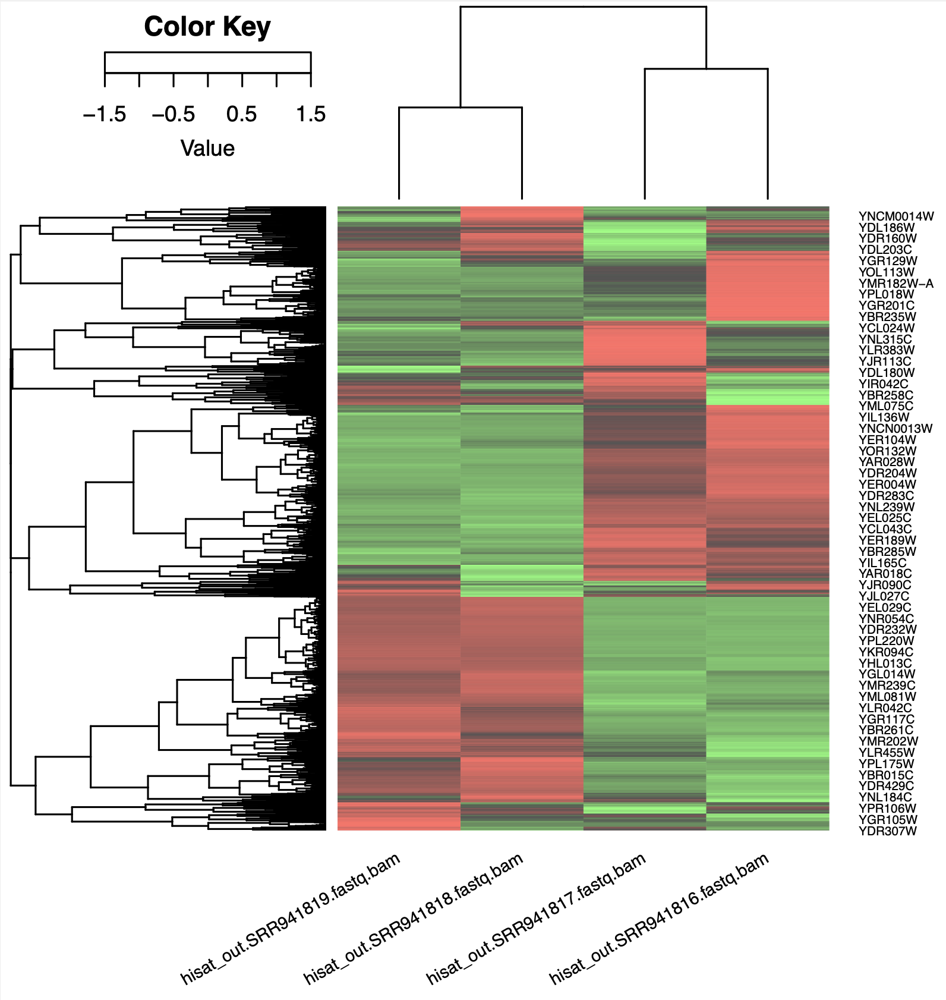
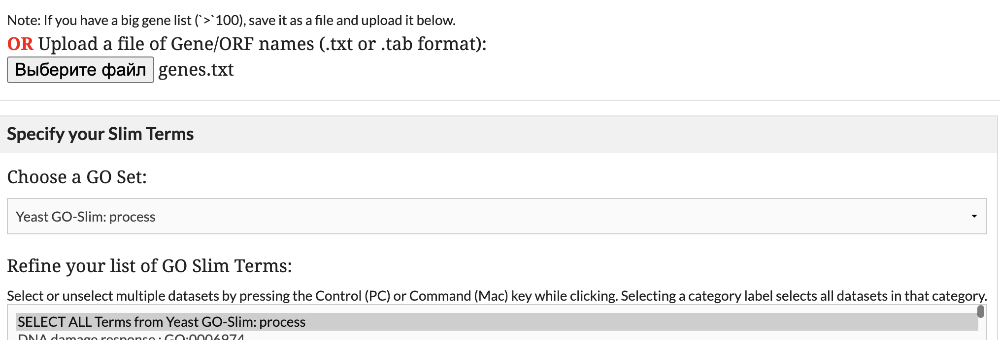

# Differential RNA expression analysis

## 1. Input data:

Download work data.
```{bash}
wget ftp://ftp.sra.ebi.ac.uk/vol1/fastq/SRR941/SRR941816/SRR941816.fastq.gz
wget ftp://ftp.sra.ebi.ac.uk/vol1/fastq/SRR941/SRR941817/SRR941817.fastq.gz
wget ftp://ftp.sra.ebi.ac.uk/vol1/fastq/SRR941/SRR941818/SRR941818.fastq.gz
wget ftp://ftp.sra.ebi.ac.uk/vol1/fastq/SRR941/SRR941819/SRR941819.fastq.gz
```

Reference genome file and annotation file.
```{bash}
wget ftp://ftp.ncbi.nlm.nih.gov/genomes/all/GCF/000/146/045/GCF_000146045.2_R64/GCF_000146045.2_R64_genomic.fna.gz
wget ftp://ftp.ncbi.nlm.nih.gov/genomes/all/GCF/000/146/045/GCF_000146045.2_R64/GCF_000146045.2_R64_genomic.gff.gz
```
## 2. Analysis Pipeline

### a) Aligning with HISAT2

Build genome index
```{bash}
hisat2-build reference_data/GCF_000146045.2_R64_genomic.fna GCF_000146045
```

Run `hisat2` in single-end mode
```{bash}
hisat2 -p 3 -x GCF_000146045 -U experiment_data/SRR941816.fastq | samtools sort > hisat_out/SRR941816.fastq.bam
hisat2 -p 3 -x GCF_000146045 -U experiment_data/SRR941817.fastq | samtools sort > hisat_out/SRR941817.fastq.bam
hisat2 -p 3 -x GCF_000146045 -U experiment_data/SRR941818.fastq | samtools sort > hisat_out/SRR941818.fastq.bam
hisat2 -p 3 -x GCF_000146045 -U experiment_data/SRR941819.fastq | samtools sort > hisat_out/SRR941819.fastq.bam
```

### b) Quantifying with featureCounts

Convert from GFF to GTF using gffread.
```{bash}
conda install gffread 
gffread reference_data/GCF_000146045.2_R64_genomic.gff -T -o reference_data/GCF_000146045.2_R64_genomic.gtf
```

Run `featureCounts`
```{bash}
featureCounts -g gene_id -a reference_data/GCF_000146045.2_R64_genomic.gtf -o SRR941816_19.fa hisat_out/SRR941816.fastq.bam hisat_out/SRR941817.fastq.bam hisat_out/SRR941818.fastq.bam hisat_out/SRR941819.fastq.bam
```

Simplify the counts: 
```{bash}
cat SRR941816_19.fa | cut -f 1,7-10 > simple_counts_16_19.txt
```

### c) Find differentially expressed genes with Deseq2

Install `DEseq2`
```{r}
if (!require("BiocManager", quietly = TRUE))
    install.packages("BiocManager")

BiocManager::install("DESeq2")
```

Calculate metrics
```{bash}
cat simple_counts_16_19.txt | R -f deseq2.r
```

Run `deseq2.r` script in RStudio

When run `draw-heatmap.r` script on `norm-matrix-deseq.txt` file in RStudio 
<br>
<div style="display: flex; gap: 10px; align-items: center;">
    
</div>
<br>

## 3. Result Interpretation

In the `result.txt` file genes are sorted by adjusted p-values. So let’s take the first 50 genes from this file using linux head utility and keep only the first column (gene names) using linux cut program:
```{bash}
head -n 50 result.txt | cut -f 1 | cut -d "-" -f 2 > genes.txt
```

Load `result.txt` data into `goSlimMapper`:
<br>
<div style="display: flex; gap: 10px; align-items: center;">
    
</div>
<br>

```
YER062C
YDR536W
YHR094C
YNL065W
YKL120W
YJL122W
YLR264W
YGR159C
YNL112W
YOR271C
YJL108C
YJL107C
YOR360C
YOL124C
YOL136C
YER127W
YLR180W
YCR072C
YNL141W
YML043C
YMR300C
YEL026W
YOR359W
YHR066W
YGR079W
YIR012W
YJL148W
YOL041C
YLR327C
YOL151W
YBL028C
YOL080C
YDL063C
YML018C
YHR196W
YNR060W
YPL212C
YBL039C
A
YJR063W
YDR037W
YNL182C
YDR449C
YMR093W
YLR224W
YJL069C
YKR097W
YBR105C
YNL248C
```